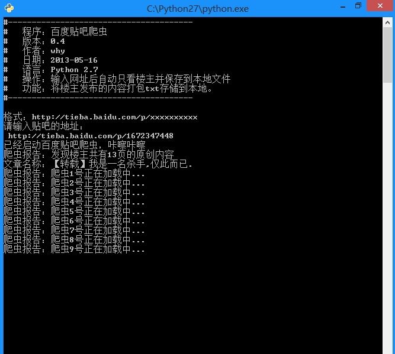
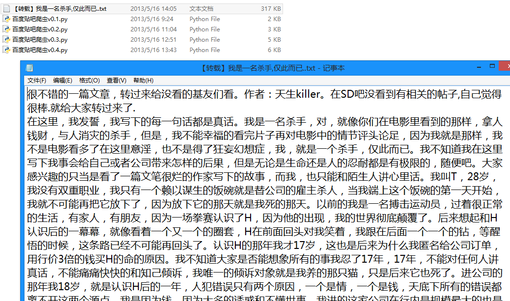

# 百度贴吧的网络爬虫（v0.4）源码及解析

更新：百度贴吧现在已经改成 utf-8 编码了吧，需要把代码中的 decode('gbk')改成 decode('utf-8')。

百度贴吧的爬虫制作和糗百的爬虫制作原理基本相同，都是通过查看源码扣出关键数据，然后将其存储到本地 txt 文件。

### 源码下载：

[http://download.csdn.net/detail/wxg694175346/6925583](http://download.csdn.net/detail/wxg694175346/6925583)

### 项目内容：

用 Python 写的百度贴吧的网络爬虫。

### 使用方法：

新建一个 BugBaidu.py 文件，然后将代码复制到里面后，双击运行。

### 程序功能：

将贴吧中楼主发布的内容打包 txt 存储到本地。

### 原理解释：

首先，先浏览一下某一条贴吧，点击只看楼主并点击第二页之后 url 发生了一点变化，变成了：  
http://tieba.baidu.com/p/2296712428?see\_lz=1&pn=1
可以看出来，see_lz=1 是只看楼主，pn=1 是对应的页码，记住这一点为以后的编写做准备。
这就是我们需要利用的 url。
接下来就是查看页面源码。
首先把题目抠出来存储文件的时候会用到。
可以看到百度使用 gbk 编码，标题使用 h1 标记：

```
<h1 class="core_title_txt" title="【原创】时尚首席（关于时尚，名利，事业，爱情，励志）">【原创】时尚首席（关于时尚，名利，事业，爱情，励志）</h1>  
```

同样，正文部分用 div 和 class 综合标记，接下来要做的只是用正则表达式来匹配即可。 

运行截图：



生成的txt文件：



```
# -*- coding: utf-8 -*-  
#---------------------------------------  
#   程序：百度贴吧爬虫  
#   版本：0.5  
#   作者：why  
#   日期：2013-05-16  
#   语言：Python 2.7  
#   操作：输入网址后自动只看楼主并保存到本地文件  
#   功能：将楼主发布的内容打包txt存储到本地。  
#---------------------------------------  
   
import string  
import urllib2  
import re  
  
#----------- 处理页面上的各种标签 -----------  
class HTML_Tool:  
    # 用非 贪婪模式 匹配 \t 或者 \n 或者 空格 或者 超链接 或者 图片  
    BgnCharToNoneRex = re.compile("(\t|\n| |<a.*?>|)")  
      
    # 用非 贪婪模式 匹配 任意<>标签  
    EndCharToNoneRex = re.compile("<.*?>")  
  
    # 用非 贪婪模式 匹配 任意<p>标签  
    BgnPartRex = re.compile("<p.*?>")  
    CharToNewLineRex = re.compile("(<br/>|</p>|<tr>|<div>|</div>)")  
    CharToNextTabRex = re.compile("<td>")  
  
    # 将一些html的符号实体转变为原始符号  
    replaceTab = [("<","<"),(">",">"),("&","&"),("&","\""),(" "," ")]  
      
    def Replace_Char(self,x):  
        x = self.BgnCharToNoneRex.sub("",x)  
        x = self.BgnPartRex.sub("\n    ",x)  
        x = self.CharToNewLineRex.sub("\n",x)  
        x = self.CharToNextTabRex.sub("\t",x)  
        x = self.EndCharToNoneRex.sub("",x)  
  
        for t in self.replaceTab:    
            x = x.replace(t[0],t[1])    
        return x    
      
class Baidu_Spider:  
    # 申明相关的属性  
    def __init__(self,url):    
        self.myUrl = url + '?see_lz=1'  
        self.datas = []  
        self.myTool = HTML_Tool()  
        print u'已经启动百度贴吧爬虫，咔嚓咔嚓'  
    
    # 初始化加载页面并将其转码储存  
    def baidu_tieba(self):  
        # 读取页面的原始信息并将其从gbk转码  
        myPage = urllib2.urlopen(self.myUrl).read().decode("gbk")  
        # 计算楼主发布内容一共有多少页  
        endPage = self.page_counter(myPage)  
        # 获取该帖的标题  
        title = self.find_title(myPage)  
        print u'文章名称：' + title  
        # 获取最终的数据  
        self.save_data(self.myUrl,title,endPage)  
  
    #用来计算一共有多少页  
    def page_counter(self,myPage):  
        # 匹配 "共有<span class="red">12</span>页" 来获取一共有多少页  
        myMatch = re.search(r'class="red">(\d+?)</span>', myPage, re.S)  
        if myMatch:    
            endPage = int(myMatch.group(1))  
            print u'爬虫报告：发现楼主共有%d页的原创内容' % endPage  
        else:  
            endPage = 0  
            print u'爬虫报告：无法计算楼主发布内容有多少页！'  
        return endPage  
  
    # 用来寻找该帖的标题  
    def find_title(self,myPage):  
        # 匹配 <h1 class="core_title_txt" title="">xxxxxxxxxx</h1> 找出标题  
        myMatch = re.search(r'<h1.*?>(.*?)</h1>', myPage, re.S)  
        title = u'暂无标题'  
        if myMatch:  
            title  = myMatch.group(1)  
        else:  
            print u'爬虫报告：无法加载文章标题！'  
        # 文件名不能包含以下字符： \ / ： * ? " < > |  
        title = title.replace('\\','').replace('/','').replace(':','').replace('*','').replace('?','').replace('"','').replace('>','').replace('<','').replace('|','')  
        return title  
  
  
    # 用来存储楼主发布的内容  
    def save_data(self,url,title,endPage):  
        # 加载页面数据到数组中  
        self.get_data(url,endPage)  
        # 打开本地文件  
        f = open(title+'.txt','w+')  
        f.writelines(self.datas)  
        f.close()  
        print u'爬虫报告：文件已下载到本地并打包成txt文件'  
        print u'请按任意键退出...'  
        raw_input();  
  
    # 获取页面源码并将其存储到数组中  
    def get_data(self,url,endPage):  
        url = url + '&pn='  
        for i in range(1,endPage+1):  
            print u'爬虫报告：爬虫%d号正在加载中...' % i  
            myPage = urllib2.urlopen(url + str(i)).read()  
            # 将myPage中的html代码处理并存储到datas里面  
            self.deal_data(myPage.decode('gbk'))  
              
  
    # 将内容从页面代码中抠出来  
    def deal_data(self,myPage):  
        myItems = re.findall('id="post_content.*?>(.*?)</div>',myPage,re.S)  
        for item in myItems:  
            data = self.myTool.Replace_Char(item.replace("\n","").encode('gbk'))  
            self.datas.append(data+'\n')  
  
  
  
#-------- 程序入口处 ------------------  
print u"""#--------------------------------------- 
#   程序：百度贴吧爬虫 
#   版本：0.5 
#   作者：why 
#   日期：2013-05-16 
#   语言：Python 2.7 
#   操作：输入网址后自动只看楼主并保存到本地文件 
#   功能：将楼主发布的内容打包txt存储到本地。 
#--------------------------------------- 
"""  
  
# 以某小说贴吧为例子  
# bdurl = 'http://tieba.baidu.com/p/2296712428?see_lz=1&pn=1'  
  
print u'请输入贴吧的地址最后的数字串：'  
bdurl = 'http://tieba.baidu.com/p/' + str(raw_input(u'http://tieba.baidu.com/p/'))   
  
#调用  
mySpider = Baidu_Spider(bdurl)  
mySpider.baidu_tieba()  
```