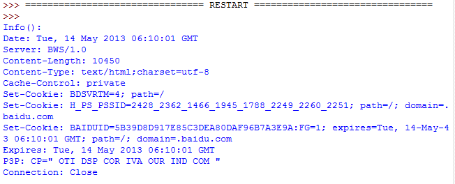

# Opener 与 Handler 的介绍和实例应用

在开始后面的内容之前，先来解释一下 urllib2 中的两个个方法：info and geturl 
urlopen 返回的应答对象 response(或者 HTTPError 实例)有两个很有用的方法 info()和 geturl()

## 1.geturl()：

这个返回获取的真实的 URL，这个很有用，因为 urlopen(或者 opener 对象使用的)或许会有重定向。获取的 URL 或许跟请求 URL 不同。

以人人中的一个超级链接为例，我们建一个 urllib2_test10.py 来比较一下原始 URL 和重定向的链接：

```
from urllib2 import Request, urlopen, URLError, HTTPError  
  
  
old_url = 'http://rrurl.cn/b1UZuP'  
req = Request(old_url)  
response = urlopen(req)    
print 'Old url :' + old_url  
print 'Real url :' + response.geturl()  
```

运行之后可以看到真正的链接指向的网址：


## 2.info()：

这个返回对象的字典对象，该字典描述了获取的页面情况。通常是服务器发送的特定头 headers。目前是 httplib.HTTPMessage 实例。
经典的headers包含"Content-length"，"Content-type"，和其他内容。

我们建一个 urllib2_test11.py 来测试一下 info 的应用：

```
from urllib2 import Request, urlopen, URLError, HTTPError  
  
old_url = 'http://www.baidu.com'  
req = Request(old_url)  
response = urlopen(req)    
print 'Info():'  
print response.info()  
```

运行的结果如下，可以看到页面的相关信息：



下面来说一说 urllib2 中的两个重要概念：Openers 和 Handlers。

### 1.Openers：

当你获取一个 URL 你使用一个 opener(一个 urllib2.OpenerDirector 的实例)。
正常情况下，我们使用默认 opener：通过 urlopen。
但你能够创建个性的 openers。

### 2.Handles：

Openers 使用处理器 handlers，所有的“繁重”工作由 handlers 处理。
每个 handlers 知道如何通过特定协议打开 URLs，或者如何处理 URL 打开时的各个方面。
例如 HTTP 重定向或者 HTTP cookies。

如果你希望用特定处理器获取 URLs 你会想创建一个 openers，例如获取一个能处理 cookie 的 opener，或者获取一个不重定向的 opener。

要创建一个 opener，可以实例化一个 OpenerDirector，
然后调用.add\_handler(some\_handler\_instance)。
同样，可以使用 build\_opener，这是一个更加方便的函数，用来创建 opener 对象，他只需要一次函数调用。
build_opener 默认添加几个处理器，但提供快捷的方法来添加或更新默认处理器。
其他的处理器 handlers 你或许会希望处理代理，验证，和其他常用但有点特殊的情况。

install\_opener 用来创建（全局）默认 opener。这个表示调用 urlopen 将使用你安装的 opener。
Opener 对象有一个 open 方法。
该方法可以像 urlopen 函数那样直接用来获取 urls：通常不必调用 install\_opener，除了为了方便。

说完了上面两个内容，下面我们来看一下基本认证的内容，这里会用到上面提及的 Opener 和 Handler。

Basic Authentication 基本验证

为了展示创建和安装一个 handler，我们将使用 HTTPBasicAuthHandler。
当需要基础验证时，服务器发送一个 header(401 错误码) 请求验证。这个指定了 scheme 和一个‘realm’，看起来像这样：Www-authenticate: SCHEME realm="REALM"。

例如

Www-authenticate: Basic realm="cPanel Users"

客户端必须使用新的请求，并在请求头里包含正确的姓名和密码。
这是“基础验证”，为了简化这个过程，我们可以创建一个 HTTPBasicAuthHandler 的实例，并让opener 使用这个 handler 就可以啦。

HTTPBasicAuthHandler 使用一个密码管理的对象来处理 URLs 和 realms 来映射用户名和密码。
如果你知道 realm(从服务器发送来的头里)是什么，你就能使用 HTTPPasswordMgr。

通常人们不关心 realm 是什么。那样的话，就能用方便的 HTTPPasswordMgrWithDefaultRealm。
这个将在你为 URL 指定一个默认的用户名和密码。
这将在你为特定 realm 提供一个其他组合时得到提供。
我们通过给 realm 参数指定 None 提供给 add_password 来指示这种情况。

最高层次的 URL 是第一个要求验证的 URL。你传给.add_password()更深层次的 URLs 将同样合适。
说了这么多废话，下面来用一个例子演示一下上面说到的内容。

我们建一个 urllib2_test12.py 来测试一下 info 的应用：

```
\# -*- coding: utf-8 -*-  
import urllib2  
  
\# 创建一个密码管理者  
password_mgr = urllib2.HTTPPasswordMgrWithDefaultRealm()  
  
\# 添加用户名和密码  
  
top_level_url = "http://example.com/foo/"  
  
\# 如果知道 realm, 我们可以使用他代替 ``None``.  
\# password_mgr.add_password(None, top_level_url, username, password)  
password_mgr.add_password(None, top_level_url,'why', '1223')  
  
\# 创建了一个新的handler  
handler = urllib2.HTTPBasicAuthHandler(password_mgr)  
  
\# 创建 "opener" (OpenerDirector 实例)  
opener = urllib2.build_opener(handler)  
  
a_url = 'http://www.baidu.com/'  
  
\# 使用 opener 获取一个URL  
opener.open(a_url)  
  
\# 安装 opener.  
\# 现在所有调用 urllib2.urlopen 将用我们的 opener.  
urllib2.install_opener(opener)  
```  
   

注意：以上的例子我们仅仅提供我们的 HHTPBasicAuthHandler 给 build_opener。
默认的 openers 有正常状况的 handlers：ProxyHandler，UnknownHandler，HTTPHandler，HTTPDefaultErrorHandler， HTTPRedirectHandler，FTPHandler， FileHandler， HTTPErrorProcessor。
代码中的 top\_level\_url 实际上可以是完整 URL(包含"http:"，以及主机名及可选的端口号)。

例如：http://example.com/。  
也可以是一个“authority”(即主机名和可选的包含端口号)。

例如：“example.com” or “example.com:8080”。  
后者包含了端口号。