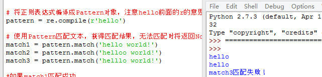

# Python 中的正则表达式教程

接下来准备用糗百做一个爬虫的小例子。
但是在这之前，先详细的整理一下 Python 中的正则表达式的相关内容。
正则表达式在 Python 爬虫中的作用就像是老师点名时用的花名册一样，是必不可少的神兵利器。

## 一、 正则表达式基础 

### 1.1.概念介绍

正则表达式是用于处理字符串的强大工具，它并不是 Python 的一部分。
其他编程语言中也有正则表达式的概念，区别只在于不同的编程语言实现支持的语法数量不同。
它拥有自己独特的语法以及一个独立的处理引擎，在提供了正则表达式的语言里，正则表达式的语法都是一样的。

下图展示了使用正则表达式进行匹配的流程：


正则表达式的大致匹配过程是：

1. 依次拿出表达式和文本中的字符比较。
2. 如果每一个字符都能匹配，则匹配成功；一旦有匹配不成功的字符则匹配失败。
3. 如果表达式中有量词或边界，这个过程会稍微有一些不同。

下图列出了 Python 支持的正则表达式元字符和语法：   


### 1.2. 数量词的贪婪模式与非贪婪模式

正则表达式通常用于在文本中查找匹配的字符串。  
贪婪模式，总是尝试匹配尽可能多的字符；  
非贪婪模式则相反，总是尝试匹配尽可能少的字符。  
Python 里数量词默认是贪婪的。  
例如：正则表达式"ab\*"如果用于查找"abbbc"，将找到"abbb"。  
而如果使用非贪婪的数量词"ab\*?"，将找到"a"。  

### 1.3. 反斜杠的问题

与大多数编程语言相同，正则表达式里使用"\"作为转义字符，这就可能造成反斜杠困扰。
假如你需要匹配文本中的字符"\"，那么使用编程语言表示的正则表达式里将需要 4 个反斜杠"\\\\"：
第一个和第三个用于在编程语言里将第二个和第四个转义成反斜杠，
转换成两个反斜杠\\后再在正则表达式里转义成一个反斜杠用来匹配反斜杠\。
这样显然是非常麻烦的。

Python 里的原生字符串很好地解决了这个问题，这个例子中的正则表达式可以使用 r"\\"表示。
同样，匹配一个数字的"\\d"可以写成r"\d"。
有了原生字符串，妈妈再也不用担心我的反斜杠问题~

## 二、 介绍re模块

### 2.1.  Compile

Python 通过 re 模块提供对正则表达式的支持。使用 re 的一般步骤是：

Step1：先将正则表达式的字符串形式编译为Pattern实例。  

Step2：然后使用Pattern实例处理文本并获得匹配结果（一个Match实例）。

Step3：最后使用Match实例获得信息，进行其他的操作。

我们新建一个 re01.py 来试验一下 re 的应用：

````
# -*- coding: utf-8 -*-  
#一个简单的re实例，匹配字符串中的hello字符串  
  
#导入re模块  
import re  
   
# 将正则表达式编译成Pattern对象，注意hello前面的r的意思是“原生字符串”  
pattern = re.compile(r'hello')  
   
# 使用Pattern匹配文本，获得匹配结果，无法匹配时将返回None  
match1 = pattern.match('hello world!')  
match2 = pattern.match('helloo world!')  
match3 = pattern.match('helllo world!')  
  
#如果match1匹配成功  
if match1:  
    # 使用Match获得分组信息  
    print match1.group()  
else:  
    print 'match1匹配失败！'  
  
  
#如果match2匹配成功  
if match2:  
    # 使用Match获得分组信息  
    print match2.group()  
else:  
    print 'match2匹配失败！'  
  
  
#如果match3匹配成功  
if match3:  
    # 使用Match获得分组信息  
    print match3.group()  
else:  
    print 'match3匹配失败！'  
```

可以看到控制台输出了匹配的三个结果：



下面来具体看看代码中的关键方法。

```
★ re.compile(strPattern[, flag]):
```

这个方法是 Pattern 类的工厂方法，用于将字符串形式的正则表达式编译为 Pattern 对象。
第二个参数 flag 是匹配模式，取值可以使用按位或运算符'|'表示同时生效，比如 re.I | re.M。
另外，你也可以在 regex 字符串中指定模式，
比如 re.compile('pattern', re.I | re.M)与re.compile('(?im)pattern')是等价的。
可选值有：


- re.I(全拼：IGNORECASE): 忽略大小写（括号内是完整写法，下同）
- re.M(全拼：MULTILINE): 多行模式，改变'^'和'$'的行为（参见上图）
- re.S(全拼：DOTALL): 点任意匹配模式，改变'.'的行为
- re.L(全拼：LOCALE): 使预定字符类 \w \W \b \B \s \S 取决于当前区域设定
- re.U(全拼：UNICODE): 使预定字符类 \w \W \b \B \s \S \d \D 取决于 unicode 定义的字符属性
- re.X(全拼：VERBOSE): 详细模式。这个模式下正则表达式可以是多行，忽略空白字符，并可以加入注释。

以下两个正则表达式是等价的：

```
# -*- coding: utf-8 -*-  
#两个等价的re匹配,匹配一个小数  
import re  
  
a = re.compile(r"""\d +  # the integral part 
                   \.    # the decimal point 
                   \d *  # some fractional digits""", re.X)  
  
b = re.compile(r"\d+\.\d*")  
  
match11 = a.match('3.1415')  
match12 = a.match('33')  
match21 = b.match('3.1415')  
match22 = b.match('33')   
  
if match11:  
    # 使用Match获得分组信息  
    print match11.group()  
else:  
    print u'match11不是小数'  
      
if match12:  
    # 使用Match获得分组信息  
    print match12.group()  
else:  
    print u'match12不是小数'  
      
if match21:  
    # 使用Match获得分组信息  
    print match21.group()  
else:  
    print u'match21不是小数'  
  
if match22:  
    # 使用Match获得分组信息  
    print match22.group()  
else:  
    print u'match22不是小数'  
```

re 提供了众多模块方法用于完成正则表达式的功能。
这些方法可以使用 Pattern 实例的相应方法替代，唯一的好处是少写一行 re.compile()代码，
但同时也无法复用编译后的 Pattern 对象。
这些方法将在 Pattern 类的实例方法部分一起介绍。
如一开始的 hello 实例可以简写为：

```
# -*- coding: utf-8 -*-  
#一个简单的re实例，匹配字符串中的hello字符串  
import re  
  
m = re.match(r'hello', 'hello world!')  
print m.group()  
```

re 模块还提供了一个方法 escape(string)，用于将 string 中的正则表达式元字符如*/+/?等之前加上转义符再返回

### 2.2. Match

Match 对象是一次匹配的结果，包含了很多关于此次匹配的信息，可以使用 Match 提供的可读属性或方法来获取这些信息。

**属性**：


- string: 匹配时使用的文本。
- re: 匹配时使用的Pattern对象。
- pos: 文本中正则表达式开始搜索的索引。值与Pattern.match()和Pattern.seach()方法的同名参数相同。
- endpos: 文本中正则表达式结束搜索的索引。值与Pattern.match()和Pattern.seach()方法的同名参数相同。
- lastindex: 最后一个被捕获的分组在文本中的索引。如果没有被捕获的分组，将为None
- lastgroup: 最后一个被捕获的分组的别名。如果这个分组没有别名或者没有被捕获的分组，将为None。

**方法**：


1. group([group1, …])：  
	获得一个或多个分组截获的字符串；指定多个参数时将以元组形式返回。group1 可以使用编号也可以使用别名；编号 0 代表整个匹配的子串；不填写参数时，返回 group(0)；没有截获字符串的组返回 None；截获了多次的组返回最后一次截获的子串。
2. groups([default])：   
	以元组形式返回全部分组截获的字符串。相当于调用 group(1,2,…last)。default 表示没有截获字符串的组以这个值替代，默认为 None。
3. groupdict([default])：  
	返回以有别名的组的别名为键、以该组截获的子串为值的字典，没有别名的组不包含在内。default 含义同上。
4. start([group])：   
	返回指定的组截获的子串在 string 中的起始索引（子串第一个字符的索引）。group 默认值为 0。
5. end([group])：  
	返回指定的组截获的子串在 string 中的结束索引（子串最后一个字符的索引+1）。group 默认值为 0。
6. span([group])：  
	返回(start(group), end(group))。
7. expand(template)：   
	将匹配到的分组代入 template 中然后返回。template 中可以使用\id或\g<id>、\g<name>引用分组，但不能使用编号 0。\id 与\g<id>是等价的；但\10 将被认为是第 10 个分组，如果你想表达\1 之后是字符'0'，只能使用\g<1>0。

下面来用一个 py 实例输出所有的内容加深理解：

```
# -*- coding: utf-8 -*-  
#一个简单的match实例  
  
import re  
# 匹配如下内容：单词+空格+单词+任意字符  
m = re.match(r'(\w+) (\w+)(?P<sign>.*)', 'hello world!')  
  
print "m.string:", m.string  
print "m.re:", m.re  
print "m.pos:", m.pos  
print "m.endpos:", m.endpos  
print "m.lastindex:", m.lastindex  
print "m.lastgroup:", m.lastgroup  
  
print "m.group():", m.group()  
print "m.group(1,2):", m.group(1, 2)  
print "m.groups():", m.groups()  
print "m.groupdict():", m.groupdict()  
print "m.start(2):", m.start(2)  
print "m.end(2):", m.end(2)  
print "m.span(2):", m.span(2)  
print r"m.expand(r'\g<2> \g<1>\g<3>'):", m.expand(r'\2 \1\3')  
   
### output ###  
# m.string: hello world!  
# m.re: <_sre.SRE_Pattern object at 0x016E1A38>  
# m.pos: 0  
# m.endpos: 12  
# m.lastindex: 3  
# m.lastgroup: sign  
# m.group(1,2): ('hello', 'world')  
# m.groups(): ('hello', 'world', '!')  
# m.groupdict(): {'sign': '!'}  
# m.start(2): 6  
# m.end(2): 11  
# m.span(2): (6, 11)  
# m.expand(r'\2 \1\3'): world hello!  
```

### 2.3. Pattern

Pattern 对象是一个编译好的正则表达式，通过 Pattern 提供的一系列方法可以对文本进行匹配查找。
Pattern 不能直接实例化，必须使用 re.compile()进行构造，也就是 re.compile()返回的对象。
Pattern 提供了几个可读属性用于获取表达式的相关信息：

- pattern: 编译时用的表达式字符串。
- flags: 编译时用的匹配模式。数字形式。
- groups: 表达式中分组的数量。
- groupindex: 以表达式中有别名的组的别名为键、以该组对应的编号为值的字典，没有别名的组不包含在内。

可以用下面这个例子查看 pattern 的属性：

```
# -*- coding: utf-8 -*-  
#一个简单的pattern实例  
  
import re  
p = re.compile(r'(\w+) (\w+)(?P<sign>.*)', re.DOTALL)  
   
print "p.pattern:", p.pattern  
print "p.flags:", p.flags  
print "p.groups:", p.groups  
print "p.groupindex:", p.groupindex  
   
### output ###  
# p.pattern: (\w+) (\w+)(?P<sign>.*)  
# p.flags: 16  
# p.groups: 3  
# p.groupindex: {'sign': 3}  
```

下面重点介绍一下 pattern 的实例方法及其使用。

#### 1.match

match(string[, pos[, endpos]]) | re.match(pattern, string[, flags])：

这个方法将从 string 的 pos 下标处起尝试匹配 pattern；如果 pattern 结束时仍可匹配，则返回一个 Match 对象；如果匹配过程中 pattern 无法匹配，或者匹配未结束就已到达 endpos，则返回 None。pos 和 endpos 的默认值分别为 0 和 len(string)；re.match()无法指定这两个参数，参数 flags用于编译 pattern时指定匹配模式。

注意：这个方法并不是完全匹配。
当 pattern 结束时若 string 还有剩余字符，仍然视为成功。
想要完全匹配，可以在表达式末尾加上边界匹配符'$'。

下面来看一个 Match 的简单案例：

```
# encoding: UTF-8  
import re  
   
# 将正则表达式编译成Pattern对象  
pattern = re.compile(r'hello')  
   
# 使用Pattern匹配文本，获得匹配结果，无法匹配时将返回None  
match = pattern.match('hello world!')  
   
if match:  
    # 使用Match获得分组信息  
    print match.group()  
   
### 输出 ###  
# hello  
```

#### 2.search

search(string[, pos[, endpos]]) | re.search(pattern, string[, flags]): 
这个方法用于查找字符串中可以匹配成功的子串。
从 string 的 pos 下标处起尝试匹配 pattern，
如果 pattern 结束时仍可匹配，则返回一个 Match 对象；
若无法匹配，则将 pos 加 1 后重新尝试匹配；
直到 pos=endpos 时仍无法匹配则返回 None。
pos 和 endpos 的默认值分别为 0 和 len(string))；
re.search()无法指定这两个参数，参数 flags 用于编译 pattern 时指定匹配模式。
那么它和 match 有什么区别呢？
match()函数只检测 re 是不是在 string 的开始位置匹配，
search()会扫描整个 string 查找匹配，

match（）只有在 0 位置匹配成功的话才有返回，如果不是开始位置匹配成功的话，match()就返回none。

例如：

print(re.match(‘super’, ‘superstition’).span())  
会返回(0, 5)

print(re.match(‘super’, ‘insuperable’))  
则返回None

search()会扫描整个字符串并返回第一个成功的匹配

例如：

print(re.search(‘super’, ‘superstition’).span())  
返回(0, 5)

print(re.search(‘super’, ‘insuperable’).span())  
返回(2, 7)

看一个 search 的实例：

```
# -*- coding: utf-8 -*-  
#一个简单的search实例  
  
import re  
   
# 将正则表达式编译成Pattern对象  
pattern = re.compile(r'world')  
   
# 使用search()查找匹配的子串，不存在能匹配的子串时将返回None  
# 这个例子中使用match()无法成功匹配  
match = pattern.search('hello world!')  
   
if match:  
    # 使用Match获得分组信息  
    print match.group()  
   
### 输出 ###  
# world  
```

#### 3.split

split(string[, maxsplit]) | re.split(pattern, string[, maxsplit]):  
按照能够匹配的子串将 string 分割后返回列表。
maxsplit 用于指定最大分割次数，不指定将全部分割。

```
import re  
   
p = re.compile(r'\d+')  
print p.split('one1two2three3four4')  
   
### output ###  
# ['one', 'two', 'three', 'four', '']  
```

#### 4.findall

findall(string[, pos[, endpos]]) | re.findall(pattern, string[, flags]):  
搜索 string，以列表形式返回全部能匹配的子串。

```
import re  
   
p = re.compile(r'\d+')  
print p.findall('one1two2three3four4')  
   
### output ###  
# ['1', '2', '3', '4']  
```

#### 5.finditer

finditer(string[, pos[, endpos]]) | re.finditer(pattern, string[, flags]):  
搜索 string，返回一个顺序访问每一个匹配结果（Match 对象）的迭代器。

```
import re  
   
p = re.compile(r'\d+')  
for m in p.finditer('one1two2three3four4'):  
    print m.group(),  
   
### output ###  
# 1 2 3 4  
```

#### 6.sub

sub(repl, string[, count]) | re.sub(pattern, repl, string[, count]):  
使用 repl 替换 string 中每一个匹配的子串后返回替换后的字符串。 
当 repl 是一个字符串时，可以使用\id 或\g<id>、\g<name>引用分组，但不能使用编号 0。 
当 repl 是一个方法时，这个方法应当只接受一个参数（Match 对象），并返回一个字符串用于替换（返回的字符串中不能再引用分组）。 
count 用于指定最多替换次数，不指定时全部替换。

```
import re  
   
p = re.compile(r'(\w+) (\w+)')  
s = 'i say, hello world!'  
   
print p.sub(r'\2 \1', s)  
   
def func(m):  
    return m.group(1).title() + ' ' + m.group(2).title()  
   
print p.sub(func, s)  
   
### output ###  
# say i, world hello!  
# I Say, Hello World!  
```

#### 7.subn

subn(repl, string[, count]) |re.sub(pattern, repl, string[, count]):  
返回 (sub(repl, string[, count])，替换次数)。

```
import re  
   
p = re.compile(r'(\w+) (\w+)')  
s = 'i say, hello world!'  
   
print p.subn(r'\2 \1', s)  
   
def func(m):  
    return m.group(1).title() + ' ' + m.group(2).title()  
   
print p.subn(func, s)  
   
### output ###  
# ('say i, world hello!', 2)  
# ('I Say, Hello World!', 2)  
```