# 爬虫框架 Scrapy 的第一个爬虫示例入门教程

我们使用 dmoz.org 这个网站来作为小抓抓一展身手的对象。

首先先要回答一个问题。

问：把网站装进爬虫里，总共分几步？  
答案很简单，四步：


- 新建项目 (Project)：新建一个新的爬虫项目
- 明确目标（Items）：明确你想要抓取的目标
- 制作爬虫（Spider）：制作爬虫开始爬取网页
- 存储内容（Pipeline）：设计管道存储爬取内容

好的，基本流程既然确定了，那接下来就一步一步的完成就可以了。

## 1.新建项目（Project）

在空目录下按住 Shift 键右击，选择“在此处打开命令窗口”，输入一下命令：

```
scrapy startproject tutorial  
```

其中，tutorial 为项目名称。

可以看到将会创建一个 tutorial 文件夹，目录结构如下：

```
tutorial/  
    scrapy.cfg  
    tutorial/  
        __init__.py  
        items.py  
        pipelines.py  
        settings.py  
        spiders/  
            __init__.py  
            ...  
```

下面来简单介绍一下各个文件的作用：


- scrapy.cfg：项目的配置文件
- tutorial/：项目的 Python 模块，将会从这里引用代码
- tutorial/items.py：项目的 items 文件
- tutorial/pipelines.py：项目的 pipelines 文件
- tutorial/settings.py：项目的设置文件
- tutorial/spiders/：存储爬虫的目录

## 2.明确目标（Item）

在 Scrapy 中，items 是用来加载抓取内容的容器，有点像 Python 中的 Dic，也就是字典，但是提供了一些额外的保护减少错误。

一般来说，item 可以用 scrapy.item.Item 类来创建，并且用 scrapy.item.Field 对象来定义属性（可以理解成类似于 ORM 的映射关系）。

接下来，我们开始来构建 item 模型（model）。

首先，我们想要的内容有：


- 名称（name）
- 链接（url）
- 描述（description）

修改 tutorial 目录下的 items.py 文件，在原本的 class 后面添加我们自己的 class。
因为要抓 dmoz.org 网站的内容，所以我们可以将其命名为 DmozItem：

```
# Define here the models for your scraped items  
#  
# See documentation in:  
# http://doc.scrapy.org/en/latest/topics/items.html  
  
from scrapy.item import Item, Field  
  
class TutorialItem(Item):  
    # define the fields for your item here like:  
    # name = Field()  
    pass  
  
class DmozItem(Item):  
    title = Field()  
    link = Field()  
    desc = Field()  
```

刚开始看起来可能会有些看不懂，但是定义这些 item 能让你用其他组件的时候知道你的 items 到底是什么。
可以把 Item 简单的理解成封装好的类对象。

## 3.制作爬虫（Spider）

制作爬虫，总体分两步：先爬再取。  
也就是说，首先你要获取整个网页的所有内容，然后再取出其中对你有用的部分。

### 3.1爬
Spider 是用户自己编写的类，用来从一个域（或域组）中抓取信息。
他们定义了用于下载的 URL 列表、跟踪链接的方案、解析网页内容的方式，以此来提取 items。
要建立一个 Spider，你必须用 scrapy.spider.BaseSpider 创建一个子类，并确定三个强制的属性：


- name：爬虫的识别名称，必须是唯一的，在不同的爬虫中你必须定义不同的名字。
- start_urls：爬取的 URL 列表。爬虫从这里开始抓取数据，所以，第一次下载的数据将会从这些 urls 开始。其他子 URL 将会从这些起始 URL 中继承性生成。
- parse()：解析的方法，调用的时候传入从每一个 URL 传回的 Response 对象作为唯一参数，负责解析并匹配抓取的数据(解析为 item)，跟踪更多的 URL。
 
这里可以参考宽度爬虫教程中提及的思想来帮助理解，教程传送：[[Java] 知乎下巴第5集：使用HttpClient工具包和宽度爬虫](http://blog.csdn.net/pleasecallmewhy/article/details/18010015)。  
也就是把 Url 存储下来并依此为起点逐步扩散开去，抓取所有符合条件的网页 Url 存储起来继续爬取。

下面我们来写第一只爬虫，命名为 dmoz_spider.py，保存在 tutorial\spiders 目录下。

dmoz_spider.py 代码如下：

```
from scrapy.spider import Spider  
  
class DmozSpider(Spider):  
    name = "dmoz"  
    allowed_domains = ["dmoz.org"]  
    start_urls = [  
        "http://www.dmoz.org/Computers/Programming/Languages/Python/Books/",  
        "http://www.dmoz.org/Computers/Programming/Languages/Python/Resources/"  
    ]  
  
    def parse(self, response):  
        filename = response.url.split("/")[-2]  
        open(filename, 'wb').write(response.body)  
```

allow_domains 是搜索的域名范围，也就是爬虫的约束区域，规定爬虫只爬取这个域名下的网页。
从 parse 函数可以看出，将链接的最后两个地址取出作为文件名进行存储。
然后运行一下看看，在 tutorial 目录下按住 shift 右击，在此处打开命令窗口，输入：

```
scrapy crawl dmoz  
```

运行结果如图：

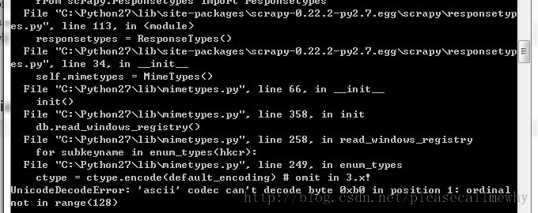

报错了：

`UnicodeDecodeError: 'ascii' codec can't decode byte 0xb0 in position 1: ordinal not in range(128)`

运行第一个 Scrapy 项目就报错，真是命运多舛。
应该是出了编码问题，谷歌了一下找到了解决方案：

在 python 的 Lib\site-packages 文件夹下新建一个 sitecustomize.py：

```
import sys    
sys.setdefaultencoding('gb2312')    
```

再次运行，OK，问题解决了，看一下结果：

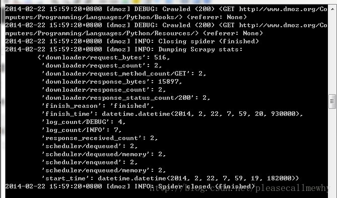

最后一句 INFO: Closing spider (finished)表明爬虫已经成功运行并且自行关闭了。
包含[dmoz]的行，那对应着我们的爬虫运行的结果。
可以看到start\_urls中定义的每个URL都有日志行。
还记得我们的start\_urls吗？  
http://www.dmoz.org/Computers/Programming/Languages/Python/Books  
http://www.dmoz.org/Computers/Programming/Languages/Python/Resources  
因为这些 URL 是起始页面，所以他们没有引用(referrers)，所以在它们的每行末尾你会看到 (referer: <None>)。
在 parse 方法的作用下，两个文件被创建：分别是 Books 和 Resources，这两个文件中有 URL 的页面内容。

那么在刚刚的电闪雷鸣之中到底发生了什么呢？
首先，Scrapy 为爬虫的 start_urls 属性中的每个 URL 创建了一个 scrapy.http.Request 对象 ，并将爬虫的 parse 方法指定为回调函数。
然后，这些 Request 被调度并执行，之后通过 parse()方法返回 scrapy.http.Response 对象，并反馈给爬虫。

### 3.2取

爬取整个网页完毕，接下来的就是的取过程了。
光存储一整个网页还是不够用的。
在基础的爬虫里，这一步可以用正则表达式来抓。
在 Scrapy 里，使用一种叫做 XPath selectors 的机制，它基于 XPath 表达式。
如果你想了解更多 selectors 和其他机制你可以查阅资料：[点我点我](http://www.w3school.com.cn/xpath/)

这是一些 XPath 表达式的例子和他们的含义


- /html/head/title: 选择 HTML 文档<head>元素下面的<title\> 标签。
- /html/head/title/text(): 选择前面提到的<title\> 元素下面的文本内容
- //td: 选择所有 <td\> 元素
- //div[@class="mine"]: 选择所有包含 class="mine" 属性的 div 标签元素

以上只是几个使用 XPath 的简单例子，但是实际上 XPath 非常强大。
可以参照 W3C 教程：[点我点我](http://www.w3school.com.cn/xpath/)。

为了方便使用 XPaths，Scrapy 提供 XPathSelector 类，有两种可以选择，HtmlXPathSelector(HTML 数据解析)和 XmlXPathSelector(XML 数据解析)。
必须通过一个 Response 对象对他们进行实例化操作。
你会发现 Selector 对象展示了文档的节点结构。因此，第一个实例化的 selector 必与根节点或者是整个目录有关 。
在 Scrapy 里面，Selectors 有四种基础的方法（点击查看 API 文档）：


- xpath()：返回一系列的 selectors，每一个 select 表示一个 xpath 参数表达式选择的节点
- css()：返回一系列的 selectors，每一个 select 表示一个 css 参数表达式选择的节点
- extract()：返回一个 unicode 字符串，为选中的数据
- re()：返回一串一个 unicode 字符串，为使用正则表达式抓取出来的内容

### 3.3xpath 实验

下面我们在 Shell 里面尝试一下 Selector 的用法。
实验的网址：[http://www.dmoz.org/Computers/Programming/Languages/Python/Books/](http://www.dmoz.org/Computers/Programming/Languages/Python/Books/)

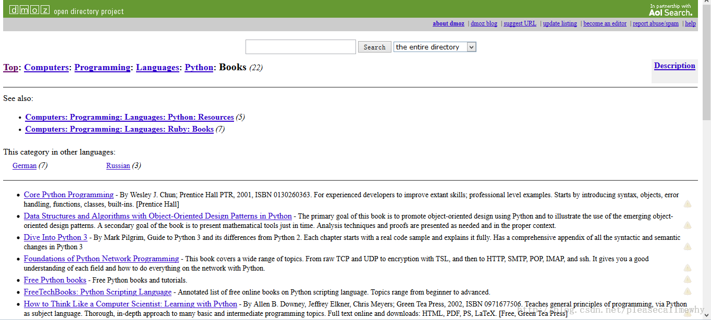

熟悉完了实验的小白鼠，接下来就是用 Shell 爬取网页了。
进入到项目的顶层目录，也就是第一层 tutorial 文件夹下，在 cmd 中输入：

```
scrapy shell http://www.dmoz.org/Computers/Programming/Languages/Python/Books/  
```

回车后可以看到如下的内容：

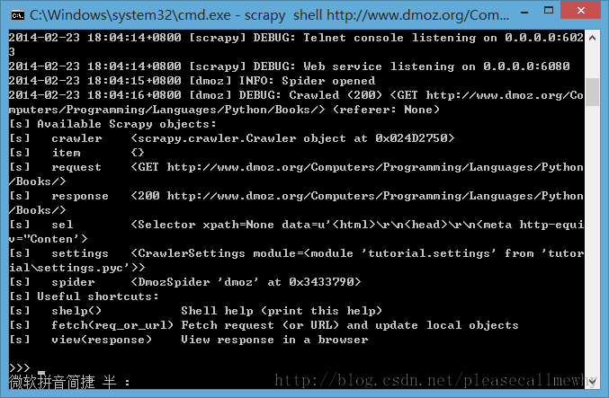

在 Shell 载入后，你将获得 response 回应，存储在本地变量 response 中。
所以如果你输入 response.body，你将会看到 response 的 body 部分，也就是抓取到的页面内容：

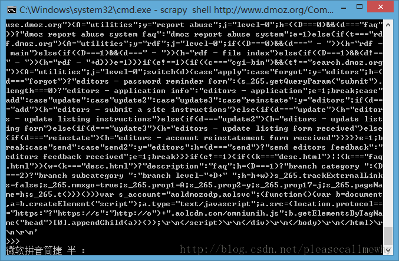

或者输入 response.headers 来查看它的 header 部分：

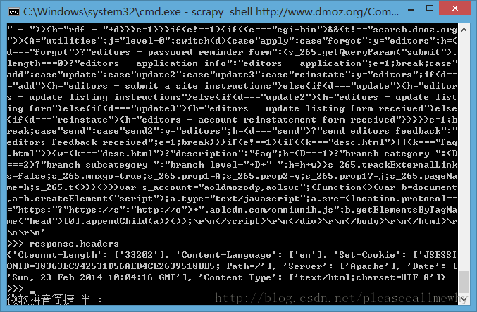

现在就像是一大堆沙子握在手里，里面藏着我们想要的金子，所以下一步，就是用筛子摇两下，把杂质出去，选出关键的内容。
selector 就是这样一个筛子。
在旧的版本中，Shell 实例化两种 selectors，一个是解析 HTML 的 hxs 变量，一个是解析 XML 的  xxs 变量。
而现在的 Shell 为我们准备好的 selector 对象，sel，可以根据返回的数据类型自动选择最佳的解析方案(XML or HTML)。
然后我们来捣弄一下！~

要彻底搞清楚这个问题，首先先要知道，抓到的页面到底是个什么样子。
比如，我们要抓取网页的标题，也就是<title\>这个标签：

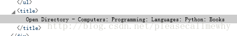

可以输入：

```
sel.xpath('//title')  
```

结果就是：

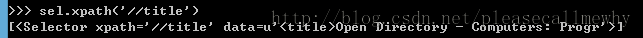

这样就能把这个标签取出来了，用 extract()和 text()还可以进一步做处理。

备注：简单的罗列一下有用的 xpath 路径表达式：

<table >
<tr>
<td>表达式</td>
<td>描述</td>
</tr>
<tr>
<td>nodename</td>
<td>选取此节点的所有子节点。</td>
</tr>
<tr>
<td>/</td>
<td>从根节点选取。</td>
</tr>
<tr>
<td>//</td>
<td>从匹配选择的当前节点选择文档中的节点，而不考虑它们的位置。</td>
</tr>
<tr>
<td>.</td>
<td>选取当前节点。</td>
</tr>
<tr>
<td>..</td>
<td>选取当前节点的父节点。</td>
</tr>
<tr>
<td>@	</td>
<td>选取属性。</td>
</table>

全部的实验结果如下，In[i]表示第 i 次实验的输入，Out[i]表示第 i 次结果的输出（建议大家参照：[W3C 教程](http://www.w3school.com.cn/xpath/xpath_nodes.asp)）：

```
In [1]: sel.xpath('//title')  
Out[1]: [<Selector xpath='//title' data=u'<title>Open Directory - Computers: Progr'>]  
  
In [2]: sel.xpath('//title').extract()  
Out[2]: [u'<title>Open Directory - Computers: Programming: Languages: Python: Books</title>']  
  
In [3]: sel.xpath('//title/text()')  
Out[3]: [<Selector xpath='//title/text()' data=u'Open Directory - Computers: Programming:'>]  
  
In [4]: sel.xpath('//title/text()').extract()  
Out[4]: [u'Open Directory - Computers: Programming: Languages: Python: Books']  
  
In [5]: sel.xpath('//title/text()').re('(\w+):')  
Out[5]: [u'Computers', u'Programming', u'Languages', u'Python']  
```

当然 title 这个标签对我们来说没有太多的价值，下面我们就来真正抓取一些有意义的东西。
使用火狐的审查元素我们可以清楚地看到，我们需要的东西如下：

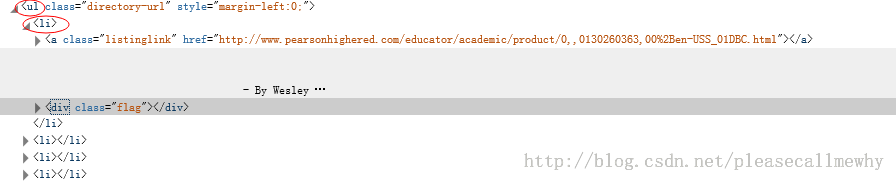

我们可以用如下代码来抓取这个<li>标签：

```
sel.xpath('//ul/li')  
```

从<li>标签中，可以这样获取网站的描述：

```
sel.xpath('//ul/li/text()').extract()  
```

可以这样获取网站的标题：

```
sel.xpath('//ul/li/a/text()').extract()  
```

可以这样获取网站的超链接：

```
sel.xpath('//ul/li/a/@href').extract()  
```

当然，前面的这些例子是直接获取属性的方法。
我们注意到 xpath 返回了一个对象列表，
那么我们也可以直接调用这个列表中对象的属性挖掘更深的节点。  
（参考：[Nesting selectors](http://doc.scrapy.org/en/latest/topics/selectors.html#topics-selectors-nesting-selectors) and[ Working with relative XPaths](http://doc.scrapy.org/en/latest/topics/selectors.html#topics-selectors-relative-xpaths) in the [Selectors](http://doc.scrapy.org/en/latest/topics/selectors.html#topics-selectors)）：

```
sites = sel.xpath('//ul/li')
for site in sites:
    title = site.xpath('a/text()').extract()
    link = site.xpath('a/@href').extract()
    desc = site.xpath('text()').extract()
    print title, link, desc
```

### 3.4xpath实战

我们用 shell 做了这么久的实战，最后我们可以把前面学习到的内容应用到 dmoz_spider 这个爬虫中。

在原爬虫的 parse 函数中做如下修改：

```
from scrapy.spider import Spider  
from scrapy.selector import Selector  
  
class DmozSpider(Spider):  
    name = "dmoz"  
    allowed_domains = ["dmoz.org"]  
    start_urls = [  
        "http://www.dmoz.org/Computers/Programming/Languages/Python/Books/",  
        "http://www.dmoz.org/Computers/Programming/Languages/Python/Resources/"  
    ]  
  
    def parse(self, response):  
        sel = Selector(response)  
        sites = sel.xpath('//ul/li')  
        for site in sites:  
            title = site.xpath('a/text()').extract()  
            link = site.xpath('a/@href').extract()  
            desc = site.xpath('text()').extract()  
            print title  
```

注意，我们从 scrapy.selector 中导入了 Selector 类，并且实例化了一个新的 Selector 对象。这样我们就可以像 Shell 中一样操作 xpath 了。

我们来试着输入一下命令运行爬虫（在 tutorial 根目录里面）：

```
scrapy crawl dmoz
```

运行结果如下：

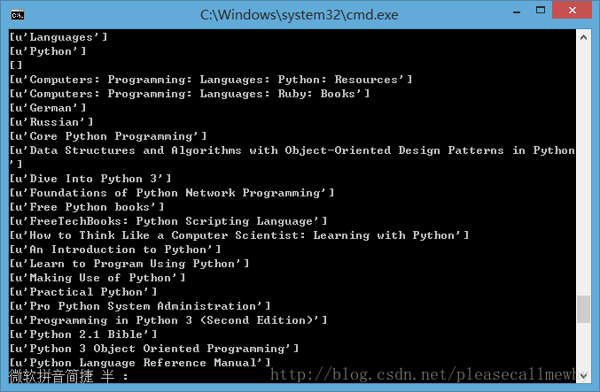

果然，成功的抓到了所有的标题。但是好像不太对啊，怎么 Top，Python 这种导航栏也抓取出来了呢？
我们只需要红圈中的内容：

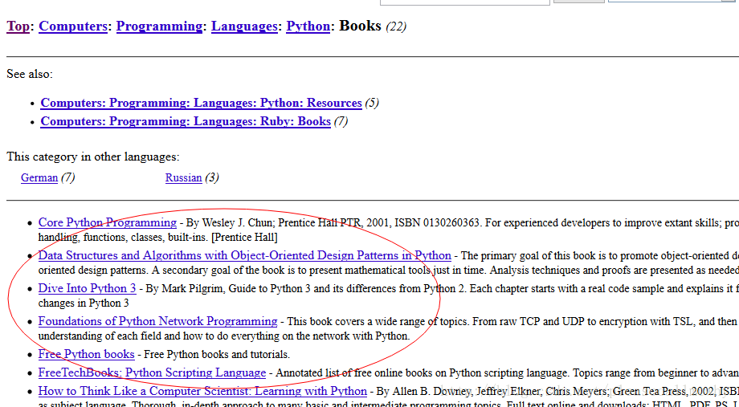

看来是我们的 xpath 语句有点问题，没有仅仅把我们需要的项目名称抓取出来，也抓了一些无辜的但是 xpath 语法相同的元素。
审查元素我们发现我们需要的<ul\>具有 class='directory-url'的属性，
那么只要把 xpath 语句改成 sel.xpath('//ul[@class="directory-url"]/li')即可
将 xpath 语句做如下调整：

```
from scrapy.spider import Spider  
from scrapy.selector import Selector  
  
class DmozSpider(Spider):  
    name = "dmoz"  
    allowed_domains = ["dmoz.org"]  
    start_urls = [  
        "http://www.dmoz.org/Computers/Programming/Languages/Python/Books/",  
        "http://www.dmoz.org/Computers/Programming/Languages/Python/Resources/"  
    ]  
  
    def parse(self, response):  
        sel = Selector(response)  
        sites = sel.xpath('//ul[@class="directory-url"]/li')  
        for site in sites:  
            title = site.xpath('a/text()').extract()  
            link = site.xpath('a/@href').extract()  
            desc = site.xpath('text()').extract()  
            print title  
```

成功抓出了所有的标题，绝对没有滥杀无辜：

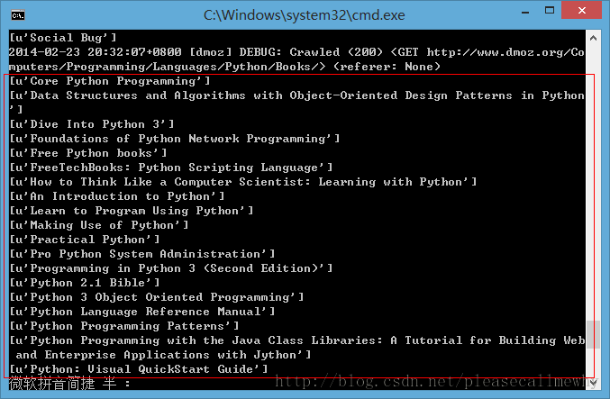

### 3.5使用 Item

接下来我们来看一看如何使用 Item。
前面我们说过，Item 对象是自定义的 python 字典，可以使用标准字典语法获取某个属性的值：

```
>>> item = DmozItem()  
>>> item['title'] = 'Example title'  
>>> item['title']  
'Example title'  
```

作为一只爬虫，Spiders 希望能将其抓取的数据存放到 Item 对象中。为了返回我们抓取数据，spider 的最终代码应当是这样:

```
from scrapy.spider import Spider  
from scrapy.selector import Selector  
  
from tutorial.items import DmozItem  
  
class DmozSpider(Spider):  
    name = "dmoz"  
    allowed_domains = ["dmoz.org"]  
    start_urls = [  
        "http://www.dmoz.org/Computers/Programming/Languages/Python/Books/",  
        "http://www.dmoz.org/Computers/Programming/Languages/Python/Resources/"  
    ]  
  
    def parse(self, response):  
        sel = Selector(response)  
        sites = sel.xpath('//ul[@class="directory-url"]/li')  
        items = []  
        for site in sites:  
            item = DmozItem()  
            item['title'] = site.xpath('a/text()').extract()  
            item['link'] = site.xpath('a/@href').extract()  
            item['desc'] = site.xpath('text()').extract()  
            items.append(item)  
        return items  
```

## 4.存储内容（Pipeline）

保存信息的最简单的方法是通过 [Feed exports](http://doc.scrapy.org/en/0.14/topics/feed-exports.html#topics-feed-exports)，主要有四种：JSON，JSON lines，CSV，XML。
我们将结果用最常用的 JSON 导出，命令如下：

```
scrapy crawl dmoz -o items.json -t json  
```

-o 后面是导出文件名，-t 后面是导出类型。
然后来看一下导出的结果，用文本编辑器打开 json 文件即可（为了方便显示，在 item 中删去了除了 title 之外的属性）：

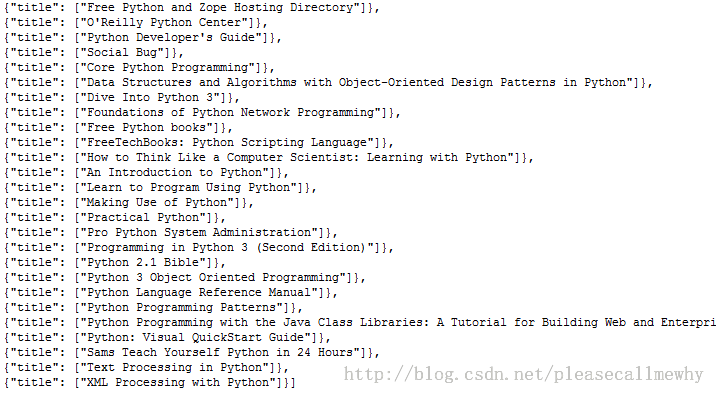

因为这个只是一个小型的例子，所以这样简单的处理就可以了。
如果你想用抓取的 items 做更复杂的事情，你可以写一个 Item Pipeline(条目管道)。
这个我们以后再慢慢玩^_^