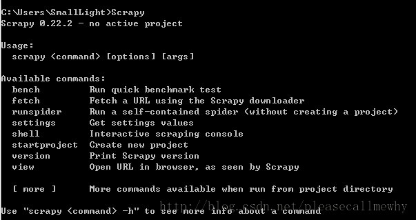

# 亮剑！爬虫框架小抓抓 Scrapy 闪亮登场！

前面十章爬虫笔记陆陆续续记录了一些简单的 Python 爬虫知识，用来解决简单的贴吧下载，绩点运算自然不在话下。不过要想批量下载大量的内容，比如知乎的所有的问答，那便显得游刃不有余了点。于是乎，爬虫框架 Scrapy 就这样出场了！Scrapy = Scrach+Python，Scrach 这个单词是抓取的意思，暂且可以叫它：小抓抓吧。

小抓抓的官网地址：[点我点我](http://doc.scrapy.org/en/latest/)。

那么下面来简单的演示一下小抓抓 Scrapy 的安装流程。  
具体流程参照：[官网教程](http://doc.scrapy.org/en/latest/intro/install.html#intro-install-platform-notes)  
友情提醒：一定要按照 Python 的版本下载，要不然安装的时候会提醒找不到 Python。建议大家安装 32 位是因为有些版本的必备软件 64 位不好找。

## 安装 Python（建议 32 位）

建议安装 Python2.7.x，3.x 貌似还不支持。
安装完了记得配置环境，将 python 目录和 python 目录下的 Scripts 目录添加到系统环境变量的 Path 里。在 cmd中输入 python 如果出现版本信息说明配置完毕。

## 安装 lxml

lxml 是一种使用 Python 编写的库，可以迅速、灵活地处理 XML。点击[这里](https://pypi.python.org/pypi/lxml/3.3.1)选择对应的 Python 版本安装。

## 安装 setuptools

用来安装 egg 文件，点击[这里](https://pypi.python.org/packages/2.7/s/setuptools/)下载 python2.7 的对应版本的 setuptools。

## 安装 zope.interface

可以使用第三步下载的 setuptools 来安装 egg 文件，现在也有 exe 版本，点击[这里](https://pypi.python.org/packages/2.7/s/setuptools/)下载。

## 安装 Twisted

Twisted 是用 Python 实现的基于事件驱动的网络引擎框架，点击[这里](http://twistedmatrix.com/trac/wiki/Downloads)下载。

## 安装 pyOpenSSL

pyOpenSSL 是 Python 的 OpenSSL 接口，点击[这里](https://launchpad.net/pyopenssl)下载。

## 安装 win32py

提供 win32api，点击[这里](http://sourceforge.net/projects/pywin32/files/)下载

## 安装 Scrapy

终于到了激动人心的时候了！安装了那么多小部件之后终于轮到主角登场。
直接在 cmd 中输入 easy_install scrapy 回车即可。

## 检查安装

打开一个 cmd 窗口，在任意位置执行 scrapy 命令，得到下列页面，表示环境配置成功。

