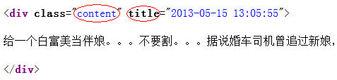
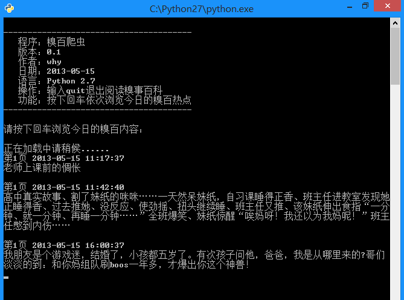

# 糗事百科的网络爬虫（v0.3）源码及解析(简化更新)

## Q&A：

### 1.为什么有段时间显示糗事百科不可用？

答：前段时间因为糗事百科添加了 Header 的检验，导致无法爬取，需要在代码中模拟Header。现在代码已经作了修改，可以正常使用。

### 2.为什么需要单独新建个线程？

答：基本流程是这样的：爬虫在后台新起一个线程，一直爬取两页的糗事百科，如果剩余不足两页，则再爬一页。用户按下回车只是从库存中获取最新的内容，而不是上网获取，所以浏览更顺畅。也可以把加载放在主线程，不过这样会导致爬取过程中等待时间过长的问题。


### 项目内容：

用 Python 写的糗事百科的网络爬虫。

### 使用方法：

新建一个 Bug.py 文件，然后将代码复制到里面后，双击运行。

### 程序功能：

在命令提示行中浏览糗事百科。

### 原理解释：

首先，先浏览一下糗事百科的主页：[http://www.qiushibaike.com/hot/page/1](http://www.qiushibaike.com/hot/page/1)
可以看出来，链接中 page/后面的数字就是对应的页码，记住这一点为以后的编写做准备。
然后，右击查看页面源码：



观察发现，每一个段子都用 div 标记，其中 class 必为 content，title 是发帖时间，我们只需要用正则表达式将其“扣”出来就可以了。
明白了原理之后，剩下的就是正则表达式的内容了，可以参照这篇博文：
[http://blog.csdn.net/wxg694175346/article/details/8929576](http://blog.csdn.net/wxg694175346/article/details/8929576)

### 运行效果：



```
# -*- coding: utf-8 -*-    
     
import urllib2    
import urllib    
import re    
import thread    
import time    
  
    
#----------- 加载处理糗事百科 -----------    
class Spider_Model:    
        
    def __init__(self):    
        self.page = 1    
        self.pages = []    
        self.enable = False    
    
    # 将所有的段子都扣出来，添加到列表中并且返回列表    
    def GetPage(self,page):    
        myUrl = "http://m.qiushibaike.com/hot/page/" + page    
        user_agent = 'Mozilla/4.0 (compatible; MSIE 5.5; Windows NT)'   
        headers = { 'User-Agent' : user_agent }   
        req = urllib2.Request(myUrl, headers = headers)   
        myResponse = urllib2.urlopen(req)  
        myPage = myResponse.read()    
        #encode的作用是将unicode编码转换成其他编码的字符串    
        #decode的作用是将其他编码的字符串转换成unicode编码    
        unicodePage = myPage.decode("utf-8")    
    
        # 找出所有class="content"的div标记    
        #re.S是任意匹配模式，也就是.可以匹配换行符    
        myItems = re.findall('<div.*?class="content".*?title="(.*?)">(.*?)</div>',unicodePage,re.S)    
        items = []    
        for item in myItems:    
            # item 中第一个是div的标题，也就是时间    
            # item 中第二个是div的内容，也就是内容    
            items.append([item[0].replace("\n",""),item[1].replace("\n","")])    
        return items    
    
    # 用于加载新的段子    
    def LoadPage(self):    
        # 如果用户未输入quit则一直运行    
        while self.enable:    
            # 如果pages数组中的内容小于2个    
            if len(self.pages) < 2:    
                try:    
                    # 获取新的页面中的段子们    
                    myPage = self.GetPage(str(self.page))    
                    self.page += 1    
                    self.pages.append(myPage)    
                except:    
                    print '无法链接糗事百科！'    
            else:    
                time.sleep(1)    
            
    def ShowPage(self,nowPage,page):    
        for items in nowPage:    
            print u'第%d页' % page , items[0]  , items[1]    
            myInput = raw_input()    
            if myInput == "quit":    
                self.enable = False    
                break    
            
    def Start(self):    
        self.enable = True    
        page = self.page    
    
        print u'正在加载中请稍候......'    
            
        # 新建一个线程在后台加载段子并存储    
        thread.start_new_thread(self.LoadPage,())    
            
        #----------- 加载处理糗事百科 -----------    
        while self.enable:    
            # 如果self的page数组中存有元素    
            if self.pages:    
                nowPage = self.pages[0]    
                del self.pages[0]    
                self.ShowPage(nowPage,page)    
                page += 1    
    
    
#----------- 程序的入口处 -----------    
print u"""  
---------------------------------------  
   程序：糗百爬虫  
   版本：0.3  
   作者：why  
   日期：2014-06-03  
   语言：Python 2.7  
   操作：输入quit退出阅读糗事百科  
   功能：按下回车依次浏览今日的糗百热点  
---------------------------------------  
"""  
    
    
print u'请按下回车浏览今日的糗百内容：'    
raw_input(' ')    
myModel = Spider_Model()    
myModel.Start()    
```