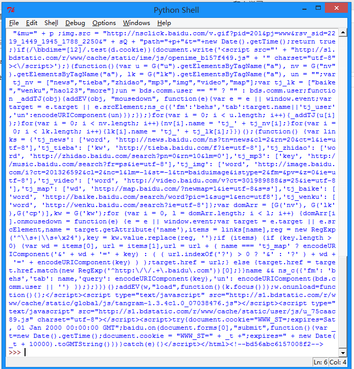

# 利用 urllib2 通过指定的 URL 抓取网页内容

版本号：Python2.7.5，Python3 改动较大，各位另寻教程。所谓网页抓取，就是把 URL 地址中指定的网络资源从网络流中读取出来，保存到本地。类似于使用程序模拟 IE 浏览器的功能，把 URL 作为 HTTP 请求的内容发送到服务器端， 然后读取服务器端的响应资源。

在 Python 中，我们使用 urllib2 这个组件来抓取网页。urllib2 是 Python 的一个获取 URLs(Uniform Resource Locators)的组件。它以 urlopen 函数的形式提供了一个非常简单的接口。最简单的 urllib2 的应用代码只需要四行。我们新建一个文件 urllib2_test01.py 来感受一下 urllib2 的作用：

```
import urllib2  
response = urllib2.urlopen('http://www.baidu.com/')  
html = response.read()  
print html  
```

按下 F5 可以看到运行的结果：



我们可以打开百度主页，右击，选择查看源代码（火狐 OR 谷歌浏览器均可），会发现也是完全一样的内容。也就是说，上面这四行代码将我们访问百度时浏览器收到的代码们全部打印了出来。这就是一个最简单的 urllib2 的例子。

除了"http:"，URL同样可以使用"ftp:"，"file:"等等来替代。HTTP 是基于请求和应答机制的：客户端提出请求，服务端提供应答。

urllib2 用一个 Request 对象来映射你提出的 HTTP 请求。在它最简单的使用形式中你将用你要请求的地址创建一个 Reques t 对象，通过调用 urlopen 并传入 Request 对象，将返回一个相关请求 response 对象，这个应答对象如同一个文件对象，所以你可以在 Response 中调用 .read()。

我们新建一个文件 urllib2_test02.py 来感受一下：


```
import urllib2    
req = urllib2.Request('http://www.baidu.com')    
response = urllib2.urlopen(req)    
the_page = response.read()    
print the_page  
```

可以看到输出的内容和 test01 是一样的。
urllib2 使用相同的接口处理所有的 URL 头。例如你可以像下面那样创建一个 ftp 请求。

```
req = urllib2.Request('ftp://example.com/')  
```

在 HTTP 请求时，允许你做额外的两件事。

## 发送 data 表单数据

这个内容相信做过 Web 端的都不会陌生，有时候你希望发送一些数据到 URL(通常 URL 与 CGI[通用网关接口]脚本，或其他 WEB 应用程序挂接)。  在 HTTP 中，这个经常使用熟知的 POST 请求发送。这个通常在你提交一个 HTML 表单时由你的浏览器来做。并不是所有的 POSTs 都来源于表单，你能够使用 POST 提交任意的数据到你自己的程序。一般的 HTML 表单，data 需要编码成标准形式。然后做为 data 参数传到 Request 对象。编码工作使用 urllib 的函数而非 urllib2。我们新建一个文件 urllib2_test03.py 来感受一下：

```
import urllib    
import urllib2    
  
url = 'http://www.someserver.com/register.cgi'    
    
values = {'name' : 'WHY',    
          'location' : 'SDU',    
          'language' : 'Python' }    
  
data = urllib.urlencode(values) # 编码工作  
req = urllib2.Request(url, data)  # 发送请求同时传data表单  
response = urllib2.urlopen(req)  #接受反馈的信息  
the_page = response.read()  #读取反馈的内容  
```

如果没有传送 data 参数，urllib2 使用 GET 方式的请求。GET 和 POST 请求的不同之处是 POST 请求通常有"副作用"，它们会由于某种途径改变系统状态(例如提交成堆垃圾到你的门口)。Data 同样可以通过在 Get 请求的 URL 本身上面编码来传送。

```
import urllib2    
import urllib  
  
data = {}  
  
data['name'] = 'WHY'    
data['location'] = 'SDU'    
data['language'] = 'Python'  
  
url_values = urllib.urlencode(data)    
print url_values  
  
name=Somebody+Here&language=Python&location=Northampton    
url = 'http://www.example.com/example.cgi'    
full_url = url + '?' + url_values  
  
data = urllib2.open(full_url)    
```

这样就实现了 Data 数据的 Get 传送。

## 设置 Headers 到 http 请求

有一些站点不喜欢被程序（非人为访问）访问，或者发送不同版本的内容到不同的浏览器。
默认的 urllib2 把自己作为“Python-urllib/x.y”(x 和 y 是 Python 主版本和次版本号，例如 Python-urllib/2.7)。

这个身份可能会让站点迷惑，或者干脆不工作。浏览器确认自己身份是通过 User-Agent 头，当你创建了一个请求对象，你可以给他一个包含头数据的字典。下面的例子发送跟上面一样的内容，但把自身模拟成 Internet Explorer。
（多谢大家的提醒，现在这个 Demo 已经不可用了，不过原理还是那样的）。

```
import urllib    
import urllib2    
  
url = 'http://www.someserver.com/cgi-bin/register.cgi'  
  
user_agent = 'Mozilla/4.0 (compatible; MSIE 5.5; Windows NT)'    
values = {'name' : 'WHY',    
          'location' : 'SDU',    
          'language' : 'Python' }    
  
headers = { 'User-Agent' : user_agent }    
data = urllib.urlencode(values)    
req = urllib2.Request(url, data, headers)    
response = urllib2.urlopen(req)    
the_page = response.read()   
```
